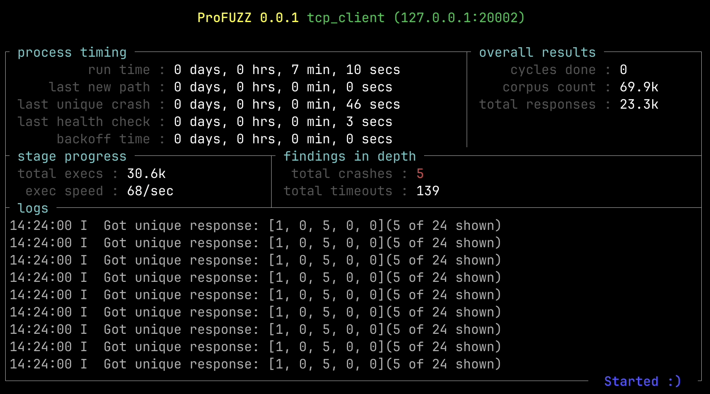
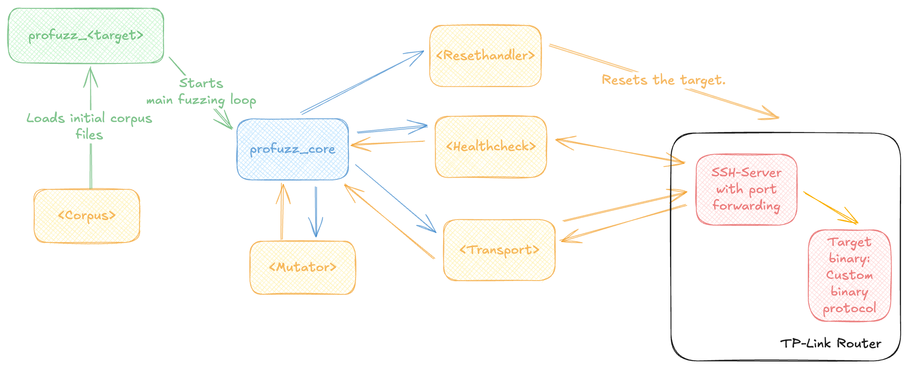

# profuzz

`profuzz` is a generic approach to easily create a fast and easy-to use protocol fuzzer for custom targets. `profuzz` aims to be used mainly in the embedded world, where most of the time it is not easy to create a running harness on a Linux-based system because of hardware dependencies, the source code is not available, or it requires hardware attacks to dump the firmware. Dumping the firmware, reverse engineering, and then fuzzing potential targets is time intensive. In these cases `profuzz` can be used to find "low-hanging" fruits by fuzzing either the network stack itself or custom binary protocols.



## The generic architecture


The `profuzz_core` highlighted in **blue** contains the main fuzzing loop, a TUI, and a CLI. It is basically the "glue" code for the target-specific crate and the implementations of all `traits` highlighted in **yellow** required to use the `profuzz_core` crate. These traits implementing the logic to communicate with the target, mutate the corpus, resetting the target or to perform a health check. In the crate `profuzz_common` multiple implementations can be found and reused for different target-specific fuzzing setups.

## Getting started

The `main` function to start `profuzz_core` must be implemented by the target-specific crate. This allows `profuzz_core` to be used either in a small setup, as shown in the [example/profuzz_network_stack](example/profuzz_network_stack/) or in a bigger project, like an automated scanning tool as one feature in many to test multiple targets.

The following code shows the basic setup required to create a network stack fuzzer. It uses a TCP server on the target to detect a crash and sends the packets directly on eth0. The TCP health check uses the [pcat](https://crates.io/crates/pcap) crate to listen for the response, which requires having `libpcap-dev` installed on your system. 

The full example can be found in the [example](example) folder.

```rs
#[tokio::main]
async fn main() {

    // Defining the `Transport` crate by using a raw linux socket provided by the profuzz_common crate.
    let transport = RawSocketTransport::new("eth0");

    // Defining the `Healthcheck` using a TCP server. The implementation is also provided by the profuzz_common crate.
    let healthcheck = TcpHealthcheck::new(
       "lo0",
       TcpPacket {
           eth_src: MacAddr::from_str("13:33:33:33:33:37").unwrap(),
           eth_dst: MacAddr::from_str("13:33:33:33:33:38").unwrap(),
           vlan_id: None,
           ipv4_src: Ipv4Addr::from([127, 0, 0, 7]),
           ipv4_dst: Ipv4Addr::from([127, 0, 0, 8]),
           sport: 1337,
           dport: 1338,
       },
   )
   .unwrap();

    // Initialization the `profuzz_core` crate by providing the different implementations for the traits
    let fuzzer = ProFuzzer::new(transport, healthcheck, DummyResetHandler());

    // Starting the CLI including a TUI, and defining the `Mutable` implementation struct that
    // implements the mutation of the corpus files also provided by the `profuzz_common` crate
    if let Err(err) = fuzzer.start_cli::<EtherMutatorOwned>().await {
        eprintln!("{err}");
    }
}
```

## Using the CLI to start the fuzzer

In case the `start_cli` function is used to start the fuzzer the following options are available at the moment:

```plain
Usage: profuzz_network_stack [OPTIONS] <COMMAND>

Commands:
  triage  Triage found crashes to identify the potential root cause
  fuzz    
  help    Print this message or the help of the given subcommand(s)

Options:
      --verbose  Verbose mode
  -h, --help     Print help
```

### Start fuzzing

To start the fuzzer the `fuzz` command can be used with the following options. When started `profuzz_core` automatically create an output directory storing all detected `crashes`.

```plain
Usage: profuzz_network_stack fuzz [OPTIONS] --in-dir <IN_DIR> --out-dir <OUT_DIR>

Options:
  -i, --in-dir <IN_DIR>    input directory with test cases
  -o, --out-dir <OUT_DIR>  output directory for fuzzer findings
      --hide-ui            Displays the profuzz UI
      --auto-resume        If output directory is not empty auto resume the session
  -h, --help               Print help
```

### Triaging a crash

When a crash is detected, e.g., the health check reports the target is not healthy `profuzz_core` stores all messages sent to the target since the last successful health check. The `triage` command then resends all the buffers while performing a health check after each send buffer. In case the health check reports unhealthy, the crash is detected and stored in the `<out-dir>/crashes/<sha1>`.

```plain
Usage: profuzz_network_stack triage --out-dir <OUT_DIR>

Options:
  -o, --out-dir <OUT_DIR>  output directory for fuzzer findings
  -h, --help               Print help
```
## Running the profuzz_tplink_tmdp example

If you want to play around with profuzz, you can use the `target_tcp_server` as a target and the `profuzz_tplink_tmpd` as a target-specific crate. First, start the target with the `simulate.sh` script. This implements an example `Resethandler` to demonstrate the resting behavior of profuzz.

```bash
cd example/target_tcp_server
./simulate.sh
```

Then in a second terminal you can start the fuzzer with:

```bash
# directly from the profuzz directory 
cargo run --bin profuzz_tplink_tmdp -- fuzz --in-dir example/profuzz_tplink_tmdp/corpus/ --out-dir /tmp/fuzzing --auto-resume
```

When the target crashes, the crash files are stored in the output dir `/tmp/fuzzing`. When the directory already exists, you can add the `--auto-resume` option to still start the fuzzer.

In case the protocol fuzzer detects a crash after around 16.4k executions, you are probably running into the TCP `TIME_WAIT` issue. You can find more details in this [blog](https://kaiwern.com/posts/2022/08/11/benchmarking-http-server-stuck-at-16k-requests/) post.

In case you are running on a Mac, you can prevent this with the following command:

```bash
sudo sysctl -w net.inet.tcp.msl=10

# If you are done you should change this back to 15000 the normal behavior.
# sudo sysctl -w net.inet.tcp.msl=15000
```

As a reference, on my machine the fuzzer then fuzzes with around 4.5k packets/s and should find after 4 second the first crash. profuzz will automatically reset the target but will end up in a loop with crash 1. So to continue fuzzing, you first should triage this crash with the following command. You probably have to manually restart the `./simulate.sh` in case it did not automatically restart.

```bash
cargo run --bin profuzz_tplink_tmdp -- triage --out-dir /tmp/fuzzing
```

After running the above command the log should look like in the following: 

```log
Triage 1/1 [y/n]? y
INFO profuzz_core::triage::dynamic: Starting with detecting the cause.
INFO profuzz_core::triage::dynamic: Starting with a healthcheck.
INFO profuzz_core::triage::dynamic: Running full test of all buffers.
INFO profuzz_core::triage::dynamic: TARGET crashed
###[ Tether ]###
 version: 1
 unknown0: 0
 tether_type: 5
 unknown1: 0
 length: 8
 unknown2: 0
 unknown3: 12
 crc32: 2965152089       << This should be highlighted in yellow 
 options: 279
 function_id: 3          << This should be highlighted in yellow

INFO profuzz_core::triage::dynamic: Crash stored in /tmp/fuzzing/crashes/c2c54fb5e43ab7e401f34e921527c8315db097f1
INFO profuzz_core::triage::dynamic: Identified the corpus that crashed the target.
```

The triage command will go through all buffers sent between the last positive health check and the negative one. After every send buffer, a health check will be performed to check if the target crashed. In case the target crashed, profuzz will search for the most similar send buffer that did not cause a crash using the Hamming distance and highlight all differences. This can be used as an aid, not as a truth. :) 

As we are able to look into the target, we can quickly verify that the crash 1 will trigger when the `function_id` is set to 3 and the `options` to `279`. As we also want to discover the other two crashes, we can now modify the `Mutator` to prevent setting the `function_id` to 3:

For this you can add the 3 to the `ignore_function_ids` hashset in the `Mutate` implementation of the `Tether` packet in the main.rs:

```rs
- let ignore_function_ids = HashSet::from([200]);
+ let ignore_function_ids = HashSet::from([200, 3]);
```

After this modification, the fuzzer should find crash 2 in 3 seconds. You now know what to do to also find Crash 3. :)

# License
This project is licensed under the [Apache-2.0](./LICENSE) license.